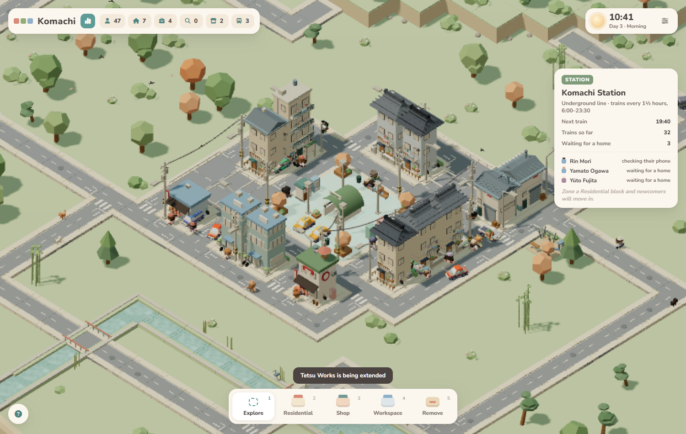
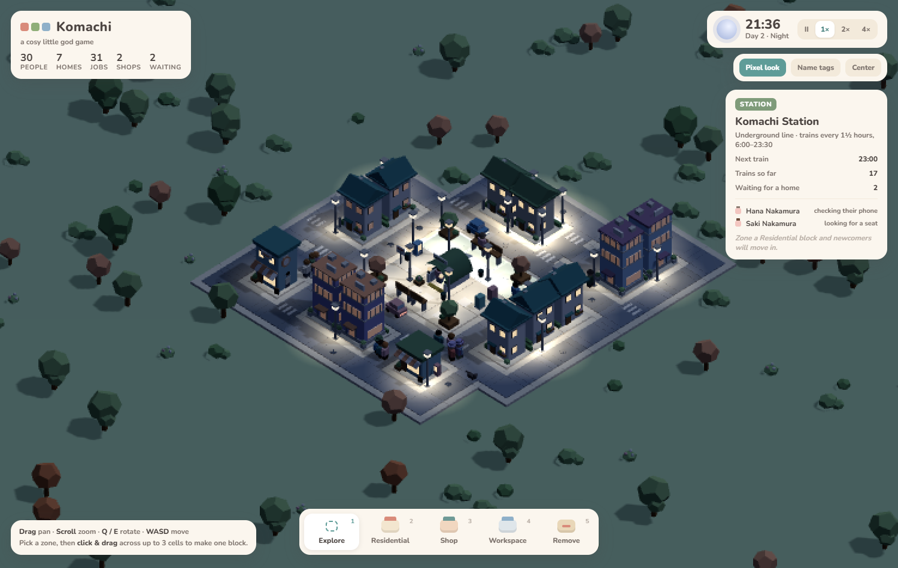
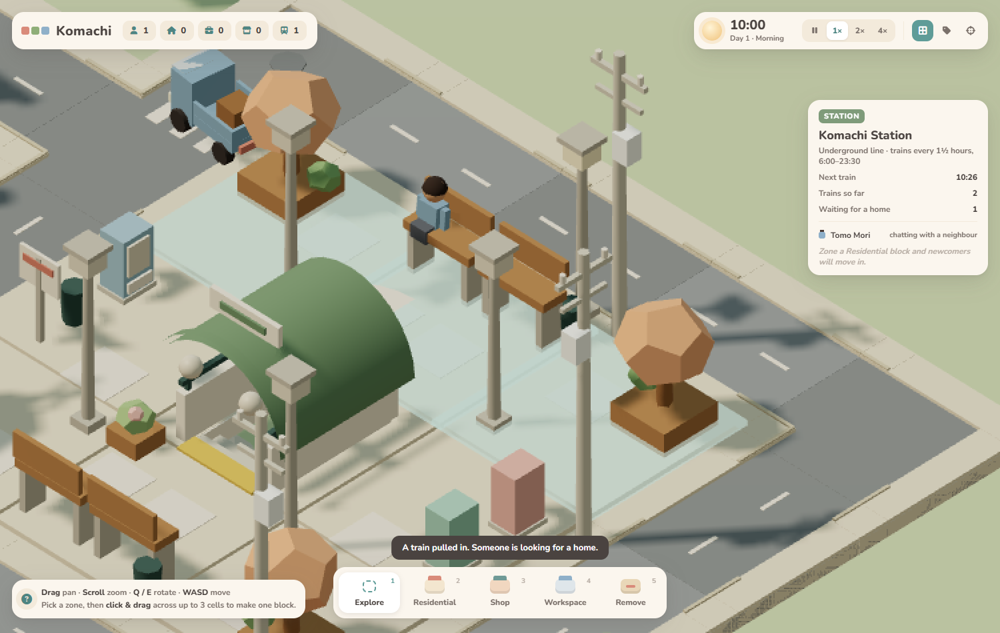
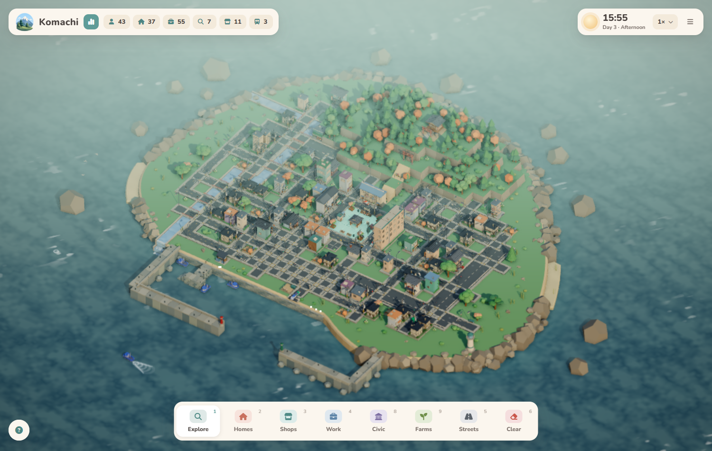
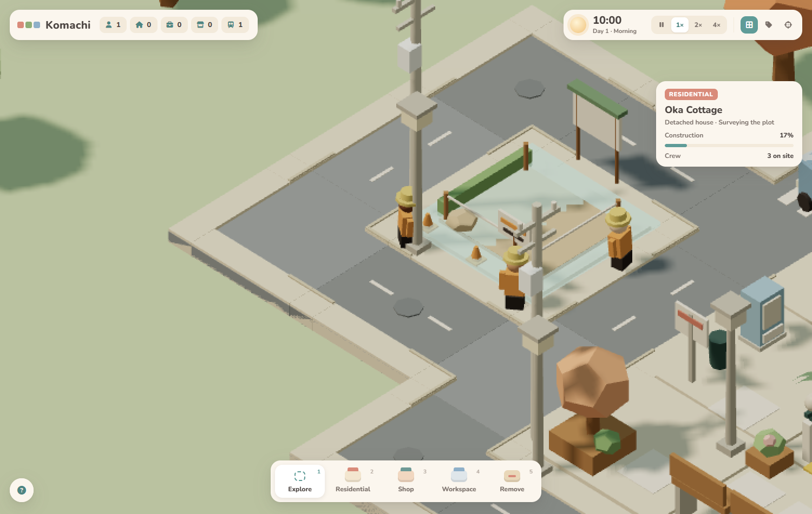

# Komachi 小町

*Komachi* (小町) means "small town". It is a cosy, retro-flavoured city diorama that plays more like a god game than a management sim.
An empty island with a single underground station in the middle. Trains bring newcomers who
sit on the benches, buy a can of tea from the vending machine, and wait for you to zone a
home. Roads grow around each block on their own, buildings rise through visible construction
stages, residents move in, find jobs, walk to work, pop out for lunch and shop in the evening.
At night the town turns soft blue while windows and street lamps glow warm.

There is nothing to lose and nothing to optimise. The pleasure is in watching.







## Quick start

```bash
npm install
npm run dev        # opens http://localhost:5173
```

URL options: `?demo` starts with a small pre-built town, `?seed=123` fixes the island shape,
`?biome=sakura` or `?biome=coastal` picks an island theme (default `suburban`).

Other scripts:

| Script | What it does |
|---|---|
| `npm run build` | Production build into `dist/` |
| `npm run preview` | Serve the production build locally |
| `npm run lint` | ESLint over `src/` |
| `npm test` | Headless smoke test of the built game (needs Chrome or Edge, see below) |

## How to play

| Action | Input |
|---|---|
| Pan | Drag (any button in Explore mode, right or middle button in any mode), or WASD / arrow keys |
| Zoom | Mouse wheel |
| Rotate | Q / E in 45° steps |
| Tools | 1 Explore · 2 Residential · 3 Shop · 4 Workspace · 5 Remove |
| Zone a block | Pick a zone, then click and drag across one to three touching cells |
| Inspect | Hover any building or person. In Explore mode, click to pin the card |
| Time | Speed buttons in the clock card, or Space to pause |
| Look | "Pixel look" toggles the half-resolution chunky render. "Name tags" labels walkers |

Some things worth knowing:

- **Everyone arrives by train.** Komachi Station sits at the centre of the island and cannot be
  removed. A train pulls in every hour and a half between 6:00 and 23:30. When a home is close to
  finished, its future household rides the next train, waits on the plaza, and walks in when the
  builders are done. Anyone still waiting at 22:00 takes the last train to the city and is back at
  06:00. Hover the station to see who is waiting and when the next train is due.
- If a house loses its residents (you removed it), they walk back to the station and wait again.
- **The island is the world.** An organic coastline with beaches, rocky stretches and grassy
  cliffs, a pier and a boat. Zoom out to see all of it; nothing can be built in the water.
- **Streets are streets.** Raised sidewalks with kerbs, dashed centre lines, zebra crossings at
  junctions. People walk on the pavement and cross at the end of their trip; cars keep left.
  Zone two blocks two cells apart and the shared gap becomes a two-lane avenue.
- **Buildings vary.** Homes come as detached houses (tile or metal roofs), narrow two-storey
  houses with exterior stairs, or small apartment blocks with balconies. Shops become cafés,
  bakeries, ramen shops, groceries, convenience stores, florists or bookshops. Workspaces are
  offices, workshops or studios. Streets get utility poles with cables, traffic mirrors, notice
  boards and bike racks.

- Everything placed in one drag becomes **one block**. Roads form around the outside of the
  block and never between the buildings inside it. Blocks are always separated by a road.
- **Builders come by train.** Zone a block and a crew rides in on the next train, walks to the
  site and works until 18:00. Nothing is built without them. Buildings pass through five visible
  stages (survey, foundations with a digger, frame, scaffolding, finishing) while kei trucks bring
  materials from the station. A home takes about one working day; shops and workspaces a little
  more. Growing a level puts the scaffolding back up for a while.
- Residents look for work at shops and workspaces they can reach by road, and follow a daily
  schedule with personal wake and finish times. About a third own cars. A home that is not
  connected to the station by road still gets residents (they cut across the grass to move in),
  but they cannot commute until a road links it up.
- Buildings **grow to level 3** once they stay occupied and the town is big enough: three or
  more blocks with both homes and jobs for level 2, six or more blocks of every kind for level 3.
- Removing a block sends its residents back to the station and clears roads that no longer touch any block.

## Project layout

An editable Blender resident and animated GLB export are available in
[`assets/characters/`](assets/characters/README.md), with preview renders in `docs/characters/`.
This character asset is not yet connected to the runtime resident system.

```
index.html            page shell (UI markup)
src/
  main.js             entry point: frame loop, dev hooks, ?demo town
  state.js            shared mutable state (time, speed, id counter, pixel look)
  palette.js          the fixed pastel palette and name pools
  utils.js            math helpers
  geometry.js         vertex-coloured primitives merged into few draw calls
  scene.js            renderer, orthographic camera, lights, the island
  world.js            grid cells, automatic roads, vegetation, lamps, block/unit records
  buildings.js        procedural buildings per zone type, variant, level and construction stage
  kit.js              shared building parts: balconies, stairs, AC units, bikes, awnings, signs
  island.js           organic coastline, beach terrace, rocks, pier; land/water test
  biome.js            island themes (colours, vegetation mix, shoreline character)
  ambient.js          bird flocks, gulls, butterflies
  construction.js     builders, crews riding the trains, material deliveries
  characters.js       rigged resident model: loading, per-person recolour, animation, sit pose
assets/characters/    Blender source and GLB for the resident character
  sim.js              time, road routing, residents and schedules, ambient traffic, growth
  daynight.js         sky, lights and emissive glow over the day
  ui.js               inspect card and stats strip
  input.js            pointer/keyboard, tools, drag selection, preview, hover picking
  toast.js            the message pill
  styles.css          all UI styling
scripts/smoke.mjs     headless browser test
docs/                 art direction, architecture notes, reference image, screenshots
```

See [docs/ARCHITECTURE.md](docs/ARCHITECTURE.md) for how the pieces fit together and
[docs/ART_DIRECTION.md](docs/ART_DIRECTION.md) for the visual rules.

## Testing

`npm test` builds nothing itself. Run `npm run build` first, then the script serves `dist/`
with `vite preview`, drives the game through the `window.MT` dev hooks in a headless
Chromium, checks zoning rules, construction, move-in, hiring, the inspect card and removal,
and saves day and night screenshots to `scripts/out/`. It looks for Edge or Chrome in the usual
places. Point `BROWSER_PATH` at a Chromium binary if yours is elsewhere.

## Deploying

A GitHub Actions workflow in `.github/workflows/deploy.yml` builds the site and publishes it to
GitHub Pages on every push to `main`. Enable Pages in the repository settings with
"GitHub Actions" as the source. The Vite config uses a relative base path, so the build also
works from any static host or sub-folder.

## Tech

Vanilla JavaScript, [Three.js](https://threejs.org/) and [Vite](https://vitejs.dev/), with
[Font Awesome](https://fontawesome.com/) for UI icons. No framework. Buildings, trees, vehicles and props are generated from boxes, prisms and dodecahedra
at runtime, people included. A rigged glTF character (`assets/characters/`) can be switched on with
`?rigged` for comparison.

## License

[MIT](LICENSE)
