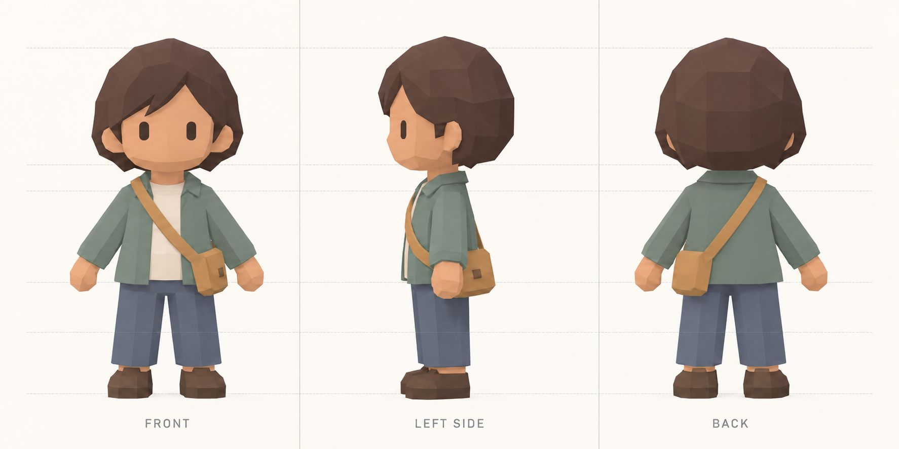

# Orthographic modeling reference

Generated using the built-in Imagegen tool from the original human character concept. Front, left-side and back views are arranged together with shared alignment guides. The back-view satchel has been corrected to the character's left hip.

This image is a modeling guide, not measured CAD. Check and calibrate each view against the shared sole and hair-top landmarks when importing into Blender; small differences in generated anatomy and alignment still need to be resolved during modeling. Use the front view as the primary proportion reference and the side view for depth.

## Initial prompt

Use case: stylized-concept
Asset type: precision orthographic character turnaround sheet for modeling in Blender.
Input image 1: the ORIGINAL approved character concept and identity reference. Preserve its design, not a redesigned version.
Primary request: Generate one clean landscape sheet with exactly THREE equal-width panels: FRONT, LEFT SIDE, BACK, in that order. The three full-body images show one and the same character in exactly the same scale and neutral A-pose, suitable to trace with Blender reference image planes.
Canvas/layout: Prefer 3072 x 1536 pixels, three equal 1024-pixel-wide panels. Identical orthographic camera scale for all three views. Center each character on the middle of its panel. Align the highest point of the hair at the same image Y coordinate and both soles on a shared horizontal baseline. Approximately 128 pixels of clear space above the hair and below the soles. Chin, shoulders, elbows, wrists, jacket hem, knees and ankles must align across all three views. Very faint thin horizontal registration lines behind the characters at hair top, chin, shoulder, jacket hem, knees and sole level. No perspective, no camera elevation, no foreshortening, no three-quarter view.
Character identity: Closely match the source's first/front character: broad softly faceted oversized head, warm medium tan skin, dark brown voluminous polygonal hair with the same side-swept fringe and rounded nape, two simple vertical dark rounded eyes, little ears, no nose or mouth detail. Muted sage-gray open jacket with small folded collar, cream undershirt, continuous slate-blue trousers, chunky dark brown low-poly shoes, small warm ochre crossbody satchel. Keep the source's head-to-body proportions, silhouette and clothing design. Continuous sleeves and trouser legs, not articulated toy blocks.
Pose: A-pose, relaxed straight arms about 25 degrees away from the torso, hands unclenched simple mitten shapes, legs straight and slightly separated, both feet flat. Same pose simply rotated in place; don't re-pose for the side or back view. Side view is a true left profile, face pointing left, near and far legs overlap naturally in profile.
Physical consistency is essential: The bag is on the CHARACTER'S LEFT HIP; its strap runs from the CHARACTER'S RIGHT SHOULDER. Thus in the front view, the bag is at viewer-right and strap runs from viewer-left shoulder to viewer-right hip. In the back view the bag must be at viewer-left, with strap running from viewer-right shoulder toward viewer-left hip. In the left-side profile the satchel sits on the near/visible hip. Preserve the same bag volume, jacket hem, hair volume, shoe length and anatomy in every view. The supplied concept's back strap is inconsistent; resolve it according to these physical instructions.
Style/materials: matte flat-shaded low-poly 3D character appearance exactly in the visual family of the original concept. Broad clean polygon facets, gentle subdued colors, clean contours for tracing. Soft neutral even studio illumination in every panel; no dramatic lighting, no cast floor shadows, no ambient occlusion halos, no vignette.
Background: uniform warm off-white. Small understated labels 'FRONT', 'LEFT SIDE', 'BACK' below the baseline, one per panel. No extra character, no extra view, no inset, no environment, no borders through bodies, no decorative layout. Prioritize geometric consistency and same-scale alignment over presentation.

## Targeted correction prompt

Edit this modeling reference sheet with one targeted correction. Preserve the entire FRONT panel, LEFT SIDE panel, all labels, guide lines, panel divisions, palette, character proportions, camera angles and canvas size.
In the BACK panel ONLY, horizontally mirror the CHARACTER around the center of its panel, without mirroring the word BACK or the background/grid. The satchel MUST now appear on the LEFT side of the BACK panel as the viewer sees it. The strap in that panel MUST start at the UPPER RIGHT SHOULDER as viewed on the page and descend diagonally to the LOWER LEFT HIP. This is required for physical consistency with the front view, where the bag appears at viewer-right. The back of the satchel should be plain, with no front clasp visible from behind. Keep the left-side view unchanged.
Scale alignment: preserve a common exact hair-top level and shoe-bottom baseline across all three figures. All character heights must remain identical. No redesign and no extra views. Return the full corrected three-panel image.
