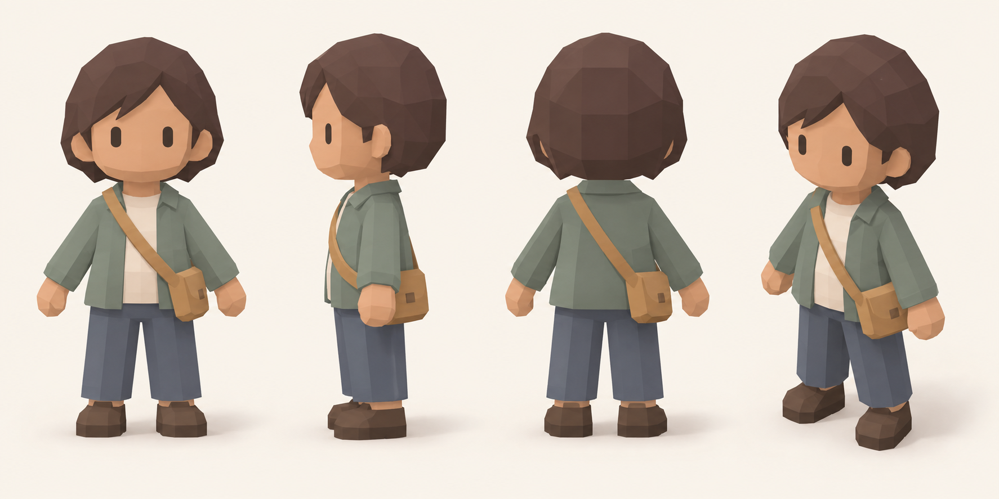

# Human resident reference

Generated with the built-in Imagegen tool. This is a raster character design reference, not a rigged 3D model or an asset loaded by the game.

## Generation prompt

Use case: stylized-concept
Asset type: human character modeling reference sheet for Komachi, a cozy low-poly Japanese suburban town diorama game.
Primary request: Design one appealing everyday adult human resident suitable for this game's tiny inhabitants. Show the SAME character consistently in four views: front orthographic, side orthographic, back orthographic, and an elevated three-quarter view at 38 degrees elevation and 45 degrees azimuth as seen by the game camera.
Style/medium: actual-looking simple flat-shaded low-poly 3D game model, chunky box torso and limbs with very slight bevels, faceted rounded head, solid polygonal hair cap. Approximately 3.5 heads tall, oversized readable head and hands, short separated legs, sturdy simple shoes. Friendly understated adult townsperson, not a baby, not anime. Easy to reproduce using boxes and a low-segment sphere in Three.js.
Subject: short dark warm-brown hair, warm medium skin, muted sage-teal casual jacket over cream shirt, slate-blue trousers, dark brown shoes, small simple ochre crossbody bag. Minimal face with two tiny dark eyes, no detailed nose or fingers. Flat solid materials, no textures or intricate seams.
Composition: polished landscape model sheet on a uniform warm off-white background, four full-body views with generous spacing, identical scale and proportions, feet aligned. Front, side and back use relaxed neutral A-pose with arms slightly separated from torso; final three-quarter view uses an easy standing pose. No scenery, no props beyond worn bag. No typography, no labels, no watermarks.
Lighting: soft upper-left key, gentle ambient fill, very soft short ground shadows, matte materials, no specular shine.
Constraints: desaturated pastel colors, crisp silhouette readable at roughly 25 pixels tall, economical geometry with visible planar facets, no photorealism, no glossy toy plastic, no neon, no black outlines, no complex clothing folds. Make a practical reference for the cozy small-scale game character, not an elaborate collectible figurine.
